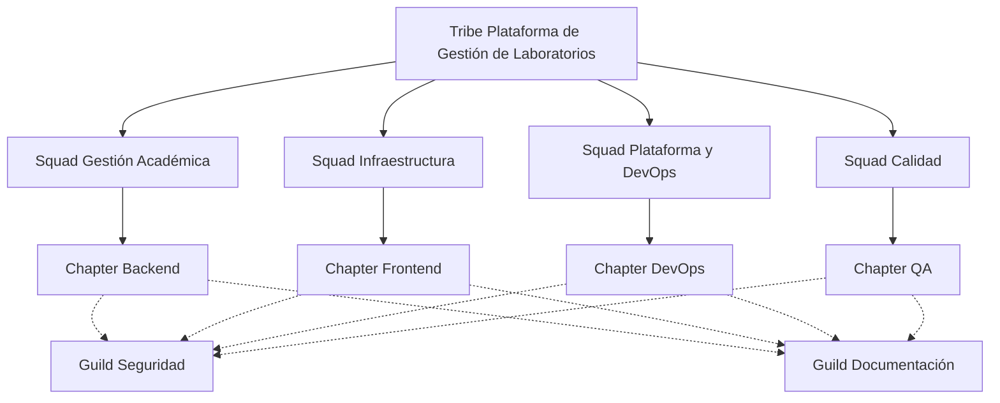

# 02. Estructura Organizacional

## 2.1 Introducción

La estructura organizacional define la forma en que se distribuyen las responsabilidades, funciones y mecanismos de coordinación entre los integrantes del proyecto. Para el desarrollo de la Plataforma de Gestión de Laboratorios se propone una estructura basada en el Modelo Spotify, el cual promueve equipos autónomos, multidisciplinarios y alineados con objetivos comunes.

Esta propuesta busca facilitar la colaboración entre los participantes, mejorar la comunicación, optimizar la toma de decisiones y permitir que el proyecto evolucione de manera incremental conforme se incorporen nuevas funcionalidades y requerimientos.

---

## 2.2 Estructura Organizacional Propuesta

El proyecto estará organizado siguiendo los principios del Modelo Spotify, adaptados al contexto académico. La organización estará conformada por un **Tribe**, varios **Squads**, **Chapters** y **Guilds**, permitiendo distribuir el trabajo de forma eficiente y fomentar la colaboración entre los miembros del equipo.

---

## 2.3 Componentes de la Organización

### Tribe

El proyecto estará conformado por un único **Tribe**, encargado de coordinar el desarrollo completo de la Plataforma de Gestión de Laboratorios. Su principal responsabilidad será garantizar que todos los equipos trabajen alineados con los objetivos del proyecto y que las funcionalidades desarrolladas respondan a las necesidades de la institución.

### Squads

Cada Squad estará conformado por un equipo multidisciplinario con autonomía para desarrollar un conjunto específico de funcionalidades.

| Squad | Responsabilidad |
|--------|-----------------|
| Gestión Académica | Administración de usuarios, docentes, estudiantes y cursos. |
| Infraestructura | Gestión de laboratorios, equipos e inventario tecnológico. |
| Plataforma y DevOps | Administración del catálogo de imágenes Docker, integración con GitLab y despliegues. |
| Calidad | Validación funcional, pruebas y mejora continua del software. |

Cada Squad planificará su trabajo mediante iteraciones cortas y realizará reuniones periódicas para revisar avances y coordinar las siguientes actividades.

### Chapters

Los Chapters agrupan a los integrantes según su especialidad técnica con el objetivo de compartir conocimientos, definir estándares y promover buenas prácticas durante el desarrollo.

Los principales Chapters propuestos son:

- Backend
- Frontend
- Base de Datos
- DevOps
- Calidad de Software

Cada Chapter contará con un responsable que facilitará la comunicación técnica entre los diferentes Squads.

### Guilds

Los Guilds representan comunidades de aprendizaje voluntarias donde los integrantes podrán compartir experiencias, herramientas y buenas prácticas relacionadas con temas específicos.

Se proponen los siguientes Guilds:

- Seguridad Informática
- Documentación Técnica
- Experiencia de Usuario (UX/UI)
- Inteligencia Artificial
- Metodologías Ágiles

Estos espacios fomentarán el aprendizaje continuo y la mejora permanente del proyecto.

---

## 2.4 Flujo de Coordinación

La coordinación entre los diferentes equipos permitirá mantener una comunicación constante durante todo el desarrollo del proyecto.

- El Tribe establecerá los objetivos generales del proyecto.
- Cada Squad planificará e implementará las funcionalidades correspondientes.
- Los Chapters velarán por mantener estándares técnicos comunes.
- Los Guilds facilitarán el intercambio de conocimientos entre los integrantes.

Esta estructura permite reducir dependencias entre equipos y favorecer la entrega continua de nuevas funcionalidades.

---

## 2.5 Beneficios de la Estructura Organizacional

La implementación de esta estructura organizacional aporta diversas ventajas para el desarrollo del proyecto:

- Favorece la autonomía de los equipos de trabajo.
- Reduce la dependencia entre módulos del sistema.
- Facilita la incorporación de nuevos integrantes.
- Promueve la comunicación y colaboración entre especialistas.
- Permite responder rápidamente a cambios en los requerimientos.
- Mantiene estándares de desarrollo mediante los Chapters.
- Incentiva la mejora continua y el aprendizaje compartido a través de los Guilds.

---

## 2.6 Conclusiones

La estructura organizacional propuesta, basada en el Modelo Spotify, proporciona un marco adecuado para el desarrollo de la Plataforma de Gestión de Laboratorios. La distribución del trabajo mediante Tribes, Squads, Chapters y Guilds permite organizar eficientemente las responsabilidades, fortalecer la colaboración entre los integrantes y facilitar la evolución continua del sistema.

Esta organización contribuye a mantener un equilibrio entre la autonomía de los equipos y la coordinación general del proyecto, favoreciendo el desarrollo de una solución escalable, mantenible y alineada con las necesidades de los usuarios.
