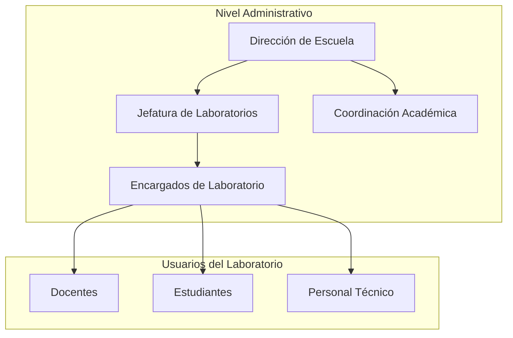
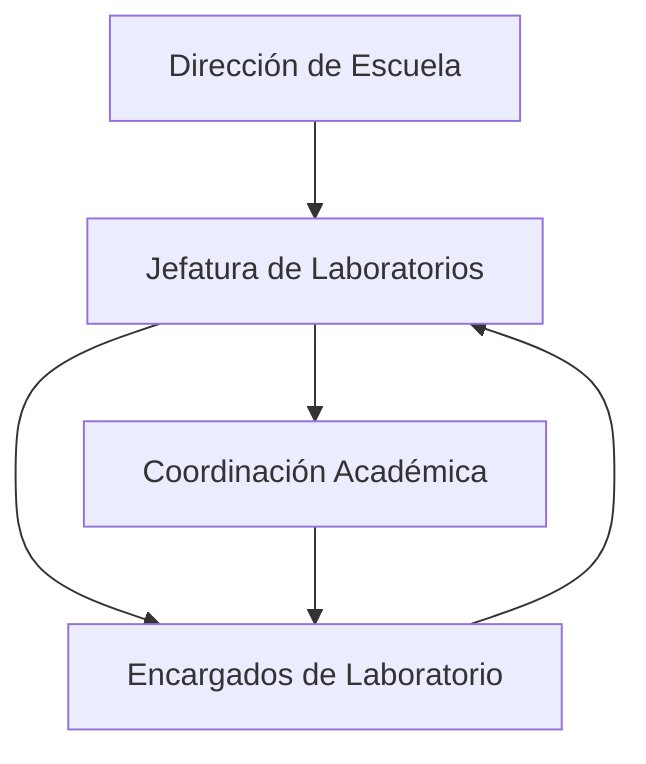
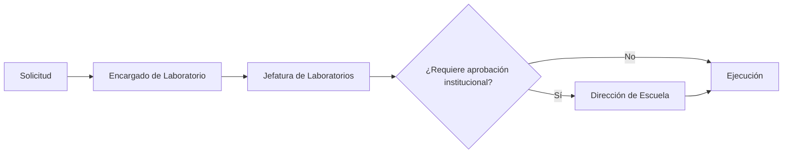

# 03. Roles de Autoridades y Encargados

## 3.1. Introducción

La implementación de una Plataforma de Gestión de Laboratorios requiere una estructura organizacional que permita distribuir adecuadamente las responsabilidades relacionadas con la administración, supervisión y mantenimiento de los recursos tecnológicos.

En se detallan las responsabilidades de las autoridades y encargados que toman decisiones administrativas, coordinan la operación institucional y garantizan el correcto funcionamiento del laboratorio.

Definir estos roles permite establecer canales claros de comunicación, evitar duplicidad de funciones y facilitar la toma de decisiones cuando se presentan solicitudes, incidencias o necesidades de mejora en la infraestructura.

---

## 3.2. Estructura General de Responsabilidades

La administración de los laboratorios puede organizarse mediante una estructura jerárquica donde cada nivel posee responsabilidades específicas y complementarias.

Los tres últimos actores (docentes, estudiantes y personal técnico) forman parte de la operación diaria del laboratorio y serán desarrollados con mayor detalle en el siguiente apartado del documento.

---

## 3.3. Roles y Responsabilidades

### Dirección de Escuela

Representa la máxima autoridad administrativa relacionada con los laboratorios de la escuela profesional. Su función principal consiste en definir lineamientos institucionales y aprobar las decisiones estratégicas que impactan en la infraestructura y los recursos tecnológicos.

Entre sus principales responsabilidades se encuentran:

- Aprobar políticas relacionadas con el uso de los laboratorios.
- Autorizar proyectos de modernización tecnológica.
- Gestionar la asignación de presupuesto para infraestructura y equipamiento.
- Supervisar el cumplimiento de los objetivos institucionales.
- Coordinar con otras dependencias cuando se requieran inversiones o ampliaciones.

---

### Jefatura de Laboratorios

La Jefatura de Laboratorios es responsable de coordinar la administración general de los recursos disponibles y garantizar que los laboratorios permanezcan operativos durante el desarrollo de las actividades académicas.

Sus funciones incluyen:

- Planificar el uso de los laboratorios durante el semestre.
- Supervisar el estado de los equipos y servicios.
- Coordinar la adquisición o renovación de software y hardware.
- Gestionar solicitudes provenientes de docentes y encargados.
- Coordinar con el personal responsable del mantenimiento preventivo y correctivo.
- Verificar el cumplimiento de las políticas establecidas por la institución.

---

### Coordinación Académica

La Coordinación Académica actúa como enlace entre la planificación académica y la disponibilidad de los laboratorios.

Sus responsabilidades principales son:

- Coordinar la programación de cursos que requieren laboratorios.
- Verificar que las necesidades académicas puedan ser cubiertas con los recursos disponibles.
- Comunicar cambios en horarios o asignaciones de ambientes.
- Coordinar con la Jefatura de Laboratorios cuando existan requerimientos especiales.

---

### Encargados de Laboratorio

Los encargados de laboratorio administran la operación cotidiana del ambiente asignado y sirven como punto de contacto entre las autoridades y los usuarios.

Entre sus funciones se encuentran:

- Supervisar el estado general del laboratorio.
- Registrar incidencias detectadas durante las sesiones.
- Verificar que los recursos se encuentren disponibles antes de cada práctica.
- Coordinar solicitudes de mantenimiento cuando sea necesario.
- Informar a la Jefatura de Laboratorios sobre problemas que requieran intervención.

---

## 3.4. Flujo General de Coordinación

Las decisiones relacionadas con la administración de los laboratorios siguen un flujo jerárquico que facilita la comunicación entre las distintas autoridades.

En este flujo, la Dirección de Escuela establece los lineamientos generales, la Jefatura de Laboratorios coordina su implementación, la Coordinación Académica comunica las necesidades derivadas de la planificación docente y los Encargados de Laboratorio supervisan la operación diaria y reportan cualquier incidencia.

---

## 3.5. Gestión de Solicitudes Administrativas

Las solicitudes relacionadas con infraestructura, adquisición de recursos o necesidades operativas deben seguir un proceso de validación antes de su ejecución.

Este procedimiento permite que las solicitudes sean evaluadas por el nivel correspondiente, evitando decisiones aisladas y asegurando un adecuado control administrativo.

---

## 3.6. Responsabilidades según el Nivel de Gestión

| Nivel | Rol principal | Responsabilidad predominante |
|:---|:---|:---|
| Estratégico | Dirección de Escuela | Define políticas, presupuesto y decisiones institucionales. |
| Táctico | Jefatura de Laboratorios | Coordina la administración y supervisa la operación general. |
| Coordinación | Coordinación Académica | Organiza la planificación académica relacionada con los laboratorios. |
| Operativo | Encargados de Laboratorio | Supervisa el funcionamiento diario y canaliza incidencias. |

---

## 3.7. Relación con los Usuarios del Sistema

Las autoridades y encargados constituyen el nivel administrativo de la plataforma y proporcionan las directrices necesarias para el funcionamiento del laboratorio. Sin embargo, la operación diaria también involucra a los usuarios que utilizan directamente los recursos tecnológicos.

Por ello, el siguiente apartado desarrolla los roles específicos de los **docentes, estudiantes y personal técnico**, describiendo sus responsabilidades operativas, permisos y nivel de interacción dentro de la Plataforma de Gestión de Laboratorios.
