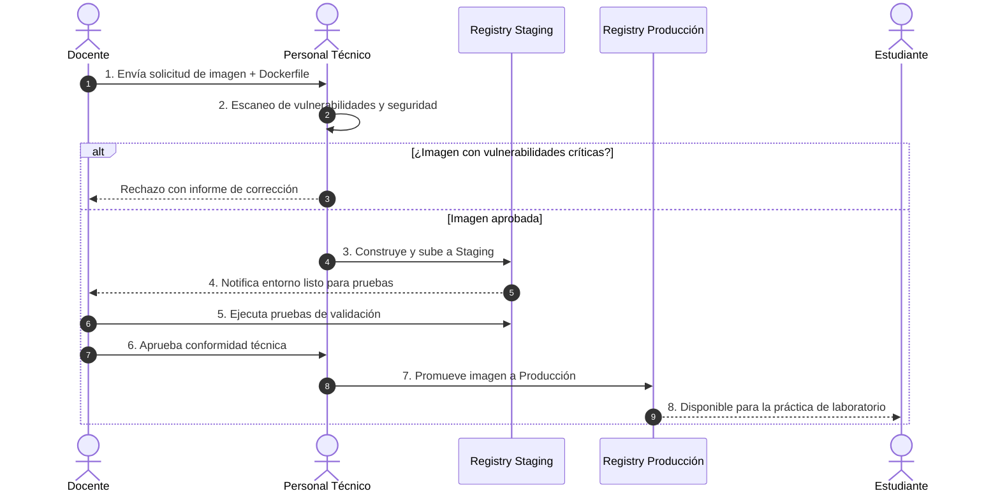
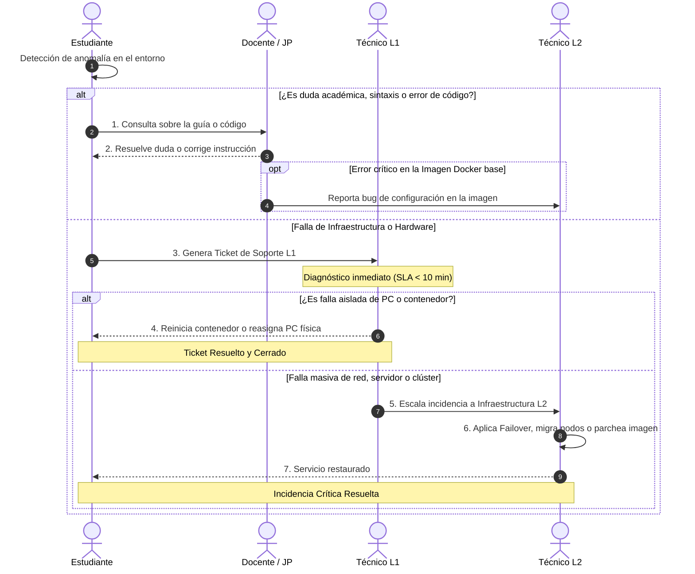

# 04. DEFINICIÓN Y GOBERNANZA DE ROLES: DOCENTES, ESTUDIANTES Y PERSONAL TÉCNICO

---

> [!NOTE]
> **Propósito del Documento:** Definir con precisión el marco de gobernanza, la matriz de permisos RBAC (*Role-Based Access Control*), las responsabilidades operativas y las interacciones entre los actores principales dentro de la Plataforma de Gestión de Laboratorios. Este marco garantiza la seguridad, la estabilidad de los entornos dockerizados y la continuidad operativa del laboratorio.

---

## 4.1. Perfiles Competenciales y Matriz de Responsabilidades

La plataforma clasifica a los usuarios en tres actores principales, divididos según su nivel de interacción técnica y responsabilidad operativa dentro del ecosistema de laboratorio.

```text
┌─────────────────────────────────────────────────────────────────────────┐
│                      Ecosistema de Laboratorios                         │
├───────────────────────┬─────────────────────────┬───────────────────────┤
│    Docentes (30%)     │    Estudiantes (65%)    │  Personal Técnico (5%)│
│  · Configuración      │  · Consumo de Entornos  │  · Mantenimiento      │
│  · Planificación      │  · Desarrollo           │  · Despliegue/SLA     │
└───────────────────────┴─────────────────────────┴───────────────────────┘
```

---

### A. Docentes e Instructores (Cátedra y Jefes de Práctica)

Son las autoridades académicas responsables de diseñar la arquitectura pedagógica y técnica de los entornos de práctica para cada asignatura.

#### 1. Responsabilidades Operativas
* **Definición de Especificaciones Técnicas:** Notificar y registrar los requerimientos de software, dependencias y archivos de configuración (`Dockerfile`, `docker-compose.yml`) con una anticipación mínima de **14 días calendario** previo al inicio del ciclo académico.
* **Validación en Entorno de *Staging*:** Realizar pruebas funcionales del contenedor dentro del ambiente de evaluación (*Staging Registry*) para verificar la compatibilidad de paquetes, puertos expuestos y montajes de volúmenes antes del despliegue masivo.
* **Gestión y Reserva de Bloques:** Programar y reservar los horarios de uso de salas físicas o recursos virtuales según el sílabo del curso.
* **Moderación Operativa durante Sesiones:** Supervisar la conducta digital de los estudiantes durante la clase y cerrar las sesiones del laboratorio al finalizar el turno.

#### 2. Matriz de Requisitos y Competencias Técnicas
* **Nivel de Dominio Linux:** Intermedio (gestión de permisos `chmod`/`chown`, variables de entorno, comandos de red básicos).
* **Nivel de Dominio Docker:** Intermedio/Avanzado (optimización de capas en `Dockerfile`, mapeo de puertos, gestión de volúmenes).
* **Control de Versiones:** Manejo funcional de Git (`git clone`, `git checkout`, gestión de `branches`).

---

### B. Estudiantes (Usuarios Finales)

Son los usuarios finales que consumen los recursos informáticos y entornos de ejecución aislados para el desarrollo de guías de laboratorio, evaluaciones y proyectos.

#### 1. Responsabilidades Operativas
* **Persistencia y Versionamiento de Código:** Reconocer que los contenedores asignados son **entornos volátiles/efímeros**. Es responsabilidad estricta del estudiante sincronizar su trabajo con repositorios externos (GitHub, GitLab, Bitbucket) o volúmenes persistentes al término de cada sesión.
* **Reporte Temprano de Anomalías:** Notificar fallas en la imagen, límites de memoria alcanzados o comportamientos anómalos del sistema mediante el módulo de *Tickets de Soporte*.
* **Cumplimiento de Políticas de Uso Aceptable (AUP):** Abstenerse de ejecutar tareas no académicas (minería de criptomonedas, escaneo de redes no autorizado, pruebas de denegación de servicio o almacenamiento de archivos personales).

#### 2. Matriz de Requisitos y Competencias Técnicas
* **Nivel de Dominio Linux:** Básico (navegación por el árbol de directorios, edición de archivos con `nano`/`vim`).
* **Nivel de Dominio Docker:** Básico (entendimiento conceptual de la diferencia entre imagen y contenedor, uso de la terminal integrada).
* **Control de Versiones:** Básico (ejecución de `git push`, `git pull`, `git commit`).

---

### C. Personal Técnico y Soporte de Infraestructura (L1 / L2)

Es el personal operativo responsable de garantizar la alta disponibilidad, la seguridad informática, la administración del servidor y el despliegue de infraestructura.

#### 1. Responsabilidades Operativas
* **Curaduría y Despliegue de Imágenes:** Revisar, analizar vulnerabilidades (mediante herramientas de análisis como *Trivy* o *Clair*) y publicar las imágenes aprobadas por los docentes en el **Registry Privado**.
* **Administración de Nodos y Redes:** Mantenimiento físico de las estaciones de trabajo, gestión del clúster de ejecución (Docker Swarm / Kubernetes), balanceo de carga y subredes virtuales aisladas (VLANs).
* **Atención y Escalado de Incidentes:** Ofrecer soporte de primer nivel (L1) durante las sesiones prácticas y soporte de segundo nivel (L2) para problemas de infraestructura.

#### 2. Matriz de Requisitos y Competencias Técnicas
* **Nivel de Dominio Linux:** Avanzado (administración de servidores, gestión de procesos, almacenamiento y Systemd).
* **Nivel de Dominio Docker & Orquestación:** Avanzado (administración de *Private Registry*, seguridad de contenedores, políticas de limitación de recursos `cgroups`).
* **Automatización:** Creación de scripts de mantenimiento automatizado (Bash, Python, Ansible).

---

## 4.2. Matriz Granular de Control de Acceso Basado en Roles (RBAC)

> [!IMPORTANT]
> Se aplica el **Principio de Menor Privilegio (PoLP)**: Cada usuario únicamente posee los permisos mínimos indispensables para realizar las actividades académicas o administrativas asignadas.

| Módulo / Funcionalidad | Operación Granular | Estudiante | Docente | Técnico L1 | Técnico L2 / Admin |
| :--- | :--- | :---: | :---: | :---: | :---: |
| **Consola / Terminal** | Acceso a contenedor interactivo | ✅ Sólamente el propio | ✅ Todos los del curso | ✅ Todos | ✅ Control Total |
| **Gestión de Imágenes** | Ver catálogo de imágenes oficiales | ✅ Lectura | ✅ Lectura | ✅ Lectura | ✅ Lectura |
| | Solicitar nueva imagen personalizada | ❌ Denegado | ✅ Crear Solicitud | ✅ Validar | ✅ Aprobar / Desplegar |
| | *Push* directo al Registry Privado | ❌ Denegado | ⚠️ Solo Staging | ⚠️ Previa revisión | ✅ Permitido |
| | Eliminación / Limpieza de imágenes (*Prune*) | ❌ Denegado | ❌ Denegado | ⚠️ Con restricción | ✅ Permitido |
| **Reserva de Laboratorios** | Ver disponibilidad de horarios | ✅ Lectura | ✅ Lectura | ✅ Lectura | ✅ Lectura |
| | Reservar bloque horario de curso | ❌ Denegado | ✅ Crear Reserva | ✅ Modificar | ✅ Control Total |
| | Modificar topología física de equipos | ❌ Denegado | ❌ Denegado | ✅ Permitido | ✅ Control Total |
| **Soporte e Incidentes** | Crear ticket de soporte técnico | ✅ Crear | ✅ Crear | N/A | N/A |
| | Diagnosticar y cerrar tickets | ❌ Denegado | ⚠️ Solo académicos | ✅ Resolver L1 | ✅ Resolver L2 |

---

## 4.3. Flujos de Interacción y Ciclo de Vida Operativo

### Diagrama 1: Flujo de Aprovisionamiento y Ciclo de Vida de una Imagen de Laboratorio



### Diagrama 2: Flujo de Gestión de Incidentes y Escalado durante la Práctica


   
## 4.4. Acuerdos de Nivel de Servicio (SLA) por Rol

Para garantizar un estándar de calidad homogéneo, se establecen los siguientes tiempos máximos de respuesta (SLA) entre los diferentes roles:

| Tipo de Requerimiento | Solicitante | Responsable | Tiempo Máximo de Respuesta (SLA) |
| :--- | :--- | :--- | :--- |
| **Aprobación de Nueva Imagen Docker** | Docente | Personal Técnico | 5 días hábiles previo al inicio de clase |
| **Atención de Incidencia Crítica en Clase** | Docente / Estudiante | Personal Técnico L1 | **< 10 minutos** durante el bloque |
| **Atención de Ticket de Incidencia Menor** | Estudiante | Personal Técnico | < 24 horas hábiles |
| **Reasignación de Estación por Falla de HW** | Estudiante | Personal Técnico L1 | **< 5 minutos** (Inmediato) |
| **Reserva Especial de Laboratorio (Proyectos)** | Docente / Investigador | Dirección / Técnico L2 | 3 días hábiles |

---

## 4.5. Protocolo de Excepciones, Incidentes de Seguridad y Mal Uso

> [!WARNING]
> **Políticas de Sanción por Incumplimiento de Roles:**
> 1. **Detección de Monopolización de Recursos:** Si un contenedor supera el 90% de consumo de CPU/RAM fuera de los parámetros del curso por más de 15 minutos, el sistema suspenderá automáticamente el proceso y notificará al Personal Técnico.
> 2. **Uso No Autorizado (Minado / Scanning):** La ejecución de procesos no autorizados resultará en la revocación inmediata de las credenciales del estudiante, suspensión del acceso al laboratorio y notificación automática a la Dirección de Escuela.
> 3. **Pérdida de Datos:** Dado que los contenedores son entornos efímeros, la plataforma **no se hace responsable** por código o archivos no sincronizados en repositorios de control de versiones (Git) al finalizar el bloque horario.
