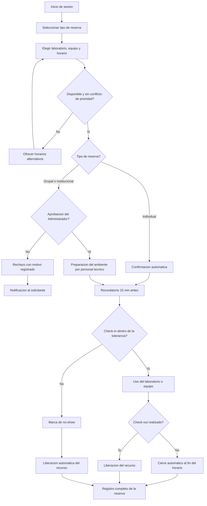

# Proceso de Reserva de Laboratorios

## 1. Introducción

Los laboratorios de computación son un recurso compartido y limitado: distintos cursos, proyectos e investigaciones compiten por los mismos ambientes, equipos y horarios. Sin un proceso formal de reserva, la asignación termina dependiendo del orden de llegada o de coordinaciones informales, lo que genera conflictos de horario, ambientes subutilizados y falta de registro sobre quién usó cada recurso.

Esta sección desarrolla el **proceso de reserva de laboratorios**: cómo un docente o estudiante reserva un ambiente o un equipo, cómo se validan y priorizan las solicitudes, qué reglas aplican para el uso (check-in, tolerancia, no-show, cancelación) y cómo se registra todo el ciclo para garantizar trazabilidad.

Este proceso se relaciona con la solicitud de imágenes (una reserva puede requerir que el ambiente tenga cargado un entorno específico) y con los roles definidos para autoridades, docentes, estudiantes y personal técnico.

---

## 2. Problemática identificada

La ausencia de un proceso formal de reserva genera los siguientes problemas:

- Choques de horario entre cursos, proyectos y uso libre de estudiantes.
- Reservas que no se utilizan (no-show) y bloquean el recurso para otros.
- Ausencia de criterios de prioridad cuando varias solicitudes compiten por el mismo horario.
- Imposibilidad de cancelar o modificar una reserva de forma ordenada.
- Falta de distinción entre la reserva individual de un equipo y la reserva grupal de un laboratorio completo para una clase.
- Falta de registro de quién usó cada equipo y en qué horario.
- Desconocimiento de la ocupación real de los laboratorios para tomar decisiones.

### 2.1 Relación entre problema, riesgo y propuesta

| Problema identificado | Riesgo generado | Propuesta de solución |
|---|---|---|
| Choques de horario entre solicitantes | Conflictos y pérdida de sesiones de clase | Validación automática de disponibilidad en un calendario único |
| Reservas sin criterios de prioridad | Asignaciones arbitrarias o injustas | Reglas de prioridad explícitas (clase programada > evaluación > proyecto > uso libre) |
| No-show sin control | Recursos bloqueados y subutilizados | Ventana de tolerancia de check-in y liberación automática |
| Falta de cancelación formal | Recursos reservados que nadie liberará | Cancelación y modificación con plazo mínimo de anticipación |
| No existe reserva grupal | Docentes sin mecanismo para reservar el laboratorio completo | Tipo de reserva grupal por curso con aprobación del Administrador |
| Uso sin registro | Sin trazabilidad ante incidentes o daños | Check-in/check-out registrado por usuario y equipo |
| Ocupación desconocida | Decisiones de horarios sin datos | Indicadores de ocupación real y tasa de no-show |

---

## 3. Objetivo general

Establecer un proceso claro, justo y trazable para la reserva, uso y liberación de los laboratorios y sus equipos, que maximice la utilización de los recursos y registre el ciclo completo de cada reserva.

---

## 4. Objetivos específicos

- Centralizar todas las reservas en un calendario único con validación automática de disponibilidad.
- Definir tipos de reserva (individual, grupal por curso, institucional) con reglas propias.
- Establecer criterios de prioridad explícitos cuando existan solicitudes en conflicto.
- Controlar el no-show mediante ventanas de tolerancia y liberación automática.
- Permitir la cancelación y modificación de reservas con reglas claras.
- Registrar check-in y check-out por usuario y por equipo para garantizar trazabilidad.
- Medir la ocupación real de los laboratorios para mejorar la planificación de horarios.

---

## 5. Alcance

La propuesta aplica a:

- Reservas de equipos individuales realizadas por estudiantes (uso libre o prácticas).
- Reservas grupales de un laboratorio completo realizadas por docentes para una clase o evaluación.
- Reservas institucionales (mantenimiento, eventos académicos, capacitaciones).
- El ciclo completo desde la solicitud hasta la liberación del recurso.

No incluye el préstamo de hardware fuera del laboratorio (equipos portátiles, periféricos), que corresponde al proceso de solicitud y asignación de recursos de hardware.

---

## 6. Roles y responsabilidades

| Rol | Responsabilidad principal |
|---|---|
| Estudiante | Reserva equipos individuales, realiza check-in/check-out y responde por el equipo durante su uso |
| Docente | Reserva el laboratorio completo para clases o evaluaciones y valida la asistencia de su curso |
| Administrador de Laboratorio | Aprueba reservas grupales e institucionales, resuelve conflictos de prioridad y supervisa la ocupación |
| Personal técnico de soporte | Prepara los ambientes antes de una reserva grupal (imágenes, equipos operativos) y atiende incidencias |
| Comité de Gestión | Define y revisa periódicamente las reglas de prioridad y las políticas de uso |

---

## 7. Tipos de reserva

| Tipo | Solicitante | Alcance | Aprobación |
|---|---|---|---|
| Individual | Estudiante | Un equipo en un horario disponible | Automática |
| Grupal (curso) | Docente | Laboratorio completo para una clase o evaluación | Administrador de Laboratorio |
| Institucional | Autoridad / Administrador | Uno o más laboratorios (mantenimiento, eventos) | Administrador de Laboratorio |

---

## 8. Reglas y políticas de uso

1. **Prioridad ante conflicto:** clase programada del semestre > evaluación > proyecto de investigación > uso libre individual. A igual prioridad, se respeta el orden de registro de la solicitud.
2. **Anticipación:** las reservas grupales deben registrarse con al menos 48 horas de anticipación; las individuales pueden hacerse hasta el mismo día, sujetas a disponibilidad.
3. **Tolerancia de check-in:** el usuario dispone de **15 minutos** desde el inicio de su reserva para realizar el check-in; vencido el plazo, la reserva se marca como no-show y el recurso se libera automáticamente.
4. **No-show reiterado:** tres no-show en un mismo mes suspenden la posibilidad de reservar por una semana. El historial se reinicia cada semestre.
5. **Cancelación y modificación:** pueden realizarse hasta 2 horas antes (individual) o 24 horas antes (grupal) del inicio, quedando registradas con fecha y motivo.
6. **Check-out obligatorio:** al finalizar el uso, el usuario realiza el check-out; si lo omite, el sistema cierra la sesión automáticamente al término del horario reservado y lo registra como cierre automático.
7. **Responsabilidad sobre el equipo:** durante la reserva, el usuario registrado responde por el equipo asignado; toda incidencia debe reportarse al personal técnico antes del check-out.

---

## 9. Descripción detallada del proceso

1. El usuario inicia sesión en la plataforma y selecciona el tipo de reserva (individual o grupal).
2. Selecciona laboratorio, equipo (si aplica), fecha y horario en el calendario único.
3. El sistema valida la disponibilidad y las reglas de prioridad en tiempo real.
4. Si existe conflicto con una reserva de mayor prioridad, el sistema ofrece horarios alternativos.
5. Las reservas individuales se confirman automáticamente; las grupales e institucionales pasan a aprobación del Administrador de Laboratorio.
6. En reservas grupales aprobadas, el personal técnico prepara el ambiente (equipos operativos e imágenes requeridas) antes del inicio.
7. El sistema envía un recordatorio 15 minutos antes del inicio de la reserva.
8. El usuario realiza el **check-in** al llegar al laboratorio (código QR en el equipo o en la entrada).
9. Si no se realiza el check-in dentro de la ventana de tolerancia, la reserva se marca como **no-show** y el recurso se libera para otros usuarios.
10. Durante el uso, las incidencias se reportan al personal técnico y quedan asociadas a la reserva.
11. Al finalizar, el usuario realiza el **check-out** y el recurso queda liberado; si lo omite, el sistema ejecuta el cierre automático al término del horario.
12. El sistema registra el ciclo completo de la reserva para los indicadores de ocupación y trazabilidad.

---

## 10. Flujo del proceso

---

## 11. Estados de una reserva

| Estado | Descripción |
|---|---|
| Registrada | La solicitud fue ingresada por el usuario |
| En aprobación | Reserva grupal o institucional pendiente del Administrador |
| Confirmada | Reserva validada y con recurso asignado |
| Rechazada | No aprobada; se registra el motivo |
| Cancelada | Anulada por el usuario dentro del plazo permitido |
| En uso | El usuario realizó el check-in y ocupa el recurso |
| No-show | El usuario no realizó check-in dentro de la tolerancia |
| Finalizada | Uso concluido con check-out (o cierre automático registrado) |

---

## 12. Indicadores del proceso

| Indicador | Meta |
|---|---|
| Tiempo promedio para completar una reserva | ≤ 5 minutos |
| Tasa de ocupación real de los laboratorios (check-in efectivos / horas disponibles) | ≥ 70% |
| Tasa de no-show mensual | ≤ 10% |
| Reservas grupales atendidas con ambiente preparado a tiempo | ≥ 95% |
| Conflictos de horario escalados al Administrador | ≤ 5% de las reservas |

---

## 13. Trazabilidad de la reserva

Toda reserva deberá registrar como mínimo:

| Campo | Descripción |
|---|---|
| Identificador de reserva | Código único generado por la plataforma |
| Usuario solicitante | Estudiante, docente o autoridad que reservó |
| Tipo de reserva | Individual, grupal o institucional |
| Curso o proyecto | Espacio académico asociado, cuando aplique |
| Laboratorio y equipo | Recurso físico asignado |
| Horario reservado | Fecha, hora de inicio y hora de fin |
| Check-in / Check-out | Marcas de tiempo reales de uso |
| Estado final | Finalizada, cancelada, no-show o rechazada (con motivo) |
| Incidencias | Reportes técnicos asociados a la reserva |
