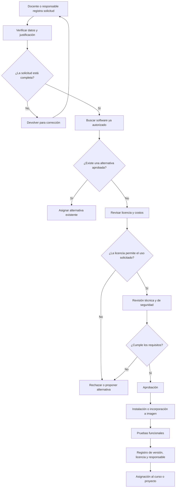
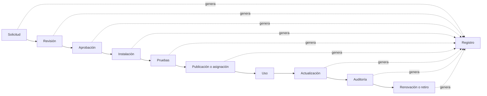
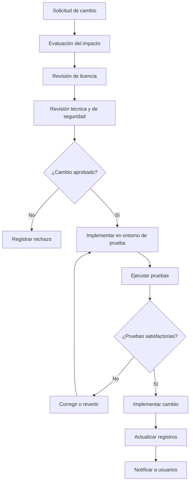

# Gestión de Software, Licencias y Trazabilidad

## 1. Introducción

La gestión de los laboratorios de computación no debe limitarse al control
de equipos físicos y horarios. También es necesario administrar el software,
las versiones instaladas, las licencias, las dependencias y los cambios
realizados durante el desarrollo de cursos y proyectos.

Una administración inadecuada puede generar incompatibilidades entre
equipos, pérdida de información, uso de programas no autorizados,
incumplimiento de licencias, vulnerabilidades de seguridad y dificultad
para reproducir los entornos empleados anteriormente.

Por ello, se propone establecer un modelo de gestión de software, licencias
y trazabilidad que permita conocer qué herramientas están autorizadas,
quién las solicitó, quién aprobó su uso, qué versión se encuentra instalada,
qué licencia posee y en qué cursos o proyectos se utiliza.

Esta sección se relaciona con la gobernanza de imágenes Docker, debido a que
las imágenes pueden contener sistemas operativos, librerías, aplicaciones,
dependencias y configuraciones que también deben ser registradas y controladas.

---

## 2. Problemática identificada

La ausencia de un proceso formal para administrar software y licencias puede
originar los siguientes problemas:

- Instalación de software sin autorización.
- Uso de diferentes versiones dentro del mismo curso.
- Falta de información sobre las dependencias instaladas.
- Uso de licencias vencidas o insuficientes.
- Utilización de licencias educativas en actividades no autorizadas.
- Inclusión de software propietario dentro de imágenes distribuidas.
- Falta de responsables para las renovaciones.
- Dificultad para reconstruir un entorno utilizado anteriormente.
- Ausencia de evidencia sobre quién realizó una instalación o actualización.
- Falta de control sobre programas obsoletos o vulnerables.
- Incremento de costos por adquisición duplicada de licencias.
- Riesgos legales, académicos, económicos y de seguridad.

### 2.1 Relación entre problema, riesgo y propuesta

| Problema identificado | Riesgo generado | Propuesta de solución |
|---|---|---|
| Software instalado sin autorización | Fallas, incompatibilidad o vulnerabilidades | Catálogo institucional de software autorizado |
| Versiones diferentes por equipo | Resultados distintos durante las prácticas | Registro y estandarización de versiones |
| Licencias no registradas | Incumplimiento contractual o legal | Inventario de licencias y responsables |
| Licencias educativas usadas en proyectos empresariales | Uso fuera de las condiciones permitidas | Clasificación por contexto de uso |
| Falta de historial de cambios | Imposibilidad de determinar responsables | Registro de trazabilidad y auditoría |
| Dependencias desconocidas | Dificultad para corregir vulnerabilidades | Generación de inventario de componentes o SBOM |
| Licencias próximas a vencer | Interrupción de cursos o proyectos | Alertas de renovación y fechas de vencimiento |
| Software obsoleto | Riesgos de seguridad y falta de soporte | Proceso de actualización o retiro controlado |

---

## 3. Objetivo general

Establecer políticas, responsabilidades, procesos y registros que permitan
gestionar de forma ordenada, segura, legal y trazable el software y las
licencias utilizadas en los laboratorios, cursos, proyectos académicos e
iniciativas empresariales.

---

## 4. Objetivos específicos

- Mantener un catálogo actualizado del software autorizado.
- Registrar las versiones instaladas en cada entorno.
- Identificar el tipo y las condiciones de cada licencia.
- Establecer responsables para la aprobación y renovación de licencias.
- Evitar la instalación de software no autorizado.
- Diferenciar el uso académico del uso empresarial.
- Registrar las solicitudes, evaluaciones, aprobaciones y modificaciones.
- Mantener evidencia de los componentes incluidos en imágenes y entornos.
- Facilitar la reproducción de cursos y proyectos anteriores.
- Establecer procedimientos de actualización, suspensión y retiro.
- Generar indicadores para evaluar el cumplimiento de las políticas.

---

## 5. Alcance

La propuesta comprende:

- Sistemas operativos.
- Aplicaciones de escritorio.
- Herramientas de desarrollo.
- Compiladores e intérpretes.
- Librerías y dependencias.
- Sistemas gestores de bases de datos.
- Plataformas de virtualización.
- Herramientas de seguridad.
- Software incorporado en imágenes Docker.
- Software utilizado en cursos y proyectos.
- Licencias institucionales, educativas y empresariales.
- Actualizaciones, parches y cambios de versión.
- Documentación técnica relacionada con cada instalación.

La propuesta se aplica tanto a los laboratorios físicos como a los entornos
virtuales, contenedores, servidores y equipos personales que utilicen
recursos oficiales proporcionados por la institución.

---

## 6. Principios de gestión

La gestión de software, licencias y trazabilidad se basará en los siguientes
principios:

### 6.1 Autorización

Ningún software deberá instalarse o incorporarse a una imagen oficial sin
haber sido previamente revisado y autorizado.

### 6.2 Necesidad

La instalación deberá responder a una necesidad académica, técnica,
administrativa o de investigación claramente identificada.

### 6.3 Legalidad

Antes de utilizar o distribuir un programa deberán revisarse sus condiciones
de licencia y las restricciones asociadas.

### 6.4 Seguridad

El software y sus dependencias deberán pasar controles técnicos antes de su
uso en laboratorios o imágenes oficiales.

### 6.5 Estandarización

Los cursos que requieran el mismo entorno deberán utilizar versiones
previamente definidas y documentadas.

### 6.6 Trazabilidad

Toda solicitud, aprobación, instalación, actualización o retiro deberá
quedar registrada.

### 6.7 Responsabilidad

Cada software y licencia deberá contar con un responsable académico y,
cuando corresponda, con un responsable técnico o administrativo.

### 6.8 Mejora continua

El catálogo, las versiones, las licencias y las políticas deberán revisarse
periódicamente.

---

## 7. Roles y responsabilidades

| Rol | Responsabilidad principal |
|---|---|
| Docente solicitante | Justificar la necesidad académica y especificar el software requerido |
| Responsable del proyecto | Justificar el uso del software dentro de un proyecto |
| Encargado del laboratorio | Verificar disponibilidad y coordinar la instalación |
| Administrador técnico | Instalar, configurar, actualizar y retirar software |
| Responsable de licencias | Verificar términos, cantidad de usuarios, vencimientos y restricciones |
| Responsable de seguridad | Revisar vulnerabilidades y riesgos técnicos |
| Responsable de imágenes | Registrar el software incorporado en las imágenes oficiales |
| Comité de Gestión | Resolver excepciones y aprobar solicitudes de alto impacto |
| Estudiante | Utilizar únicamente el software y las versiones autorizadas |
| Director o autoridad | Autorizar adquisiciones, contratos o decisiones institucionales |

---

## 8. Matriz RACI

La matriz RACI utiliza las siguientes letras:

- **R:** responsable de ejecutar.
- **A:** autoridad que aprueba.
- **C:** persona consultada.
- **I:** persona informada.

| Actividad | Docente | Encargado | Administrador técnico | Responsable de licencias | Seguridad | Comité |
|---|---:|---:|---:|---:|---:|---:|
| Solicitar software | R | C | C | I | I | I |
| Evaluar necesidad académica | A/R | C | C | I | I | I |
| Verificar licencia | C | I | C | A/R | C | I |
| Verificar seguridad | C | I | C | C | A/R | I |
| Aprobar software de uso ordinario | C | A | R | C | C | I |
| Aprobar software con costo o restricción | C | C | C | R | C | A |
| Instalar y configurar | C | I | A/R | I | C | I |
| Registrar versión | C | I | A/R | C | C | I |
| Renovar licencia | I | C | C | A/R | I | C |
| Retirar software | C | A | R | C | C | I |
| Auditar registros | I | C | C | R | C | A |

---

## 9. Catálogo de software autorizado

Se propone implementar un catálogo centralizado que permita consultar las
herramientas aprobadas para los laboratorios.

Cada registro deberá contener como mínimo:

| Campo | Descripción |
|---|---|
| Código | Identificador único del software |
| Nombre | Nombre oficial del programa |
| Proveedor o proyecto | Empresa, institución o comunidad responsable |
| Versión autorizada | Versión aprobada para su uso |
| Categoría | Desarrollo, base de datos, diseño, seguridad, etc. |
| Tipo de licencia | Libre, educativa, comercial, institucional o temporal |
| Identificador de licencia | Identificador normalizado cuando corresponda |
| Contexto permitido | Académico, investigación, empresarial o administrativo |
| Cantidad autorizada | Número de usuarios, equipos o instalaciones |
| Fecha de aprobación | Fecha en la que se autorizó |
| Fecha de vencimiento | Fecha de renovación o término |
| Responsable académico | Docente o área solicitante |
| Responsable técnico | Encargado de instalación y mantenimiento |
| Cursos o proyectos | Espacios donde se utiliza |
| Estado | Solicitado, aprobado, suspendido, obsoleto o retirado |
| Observaciones | Restricciones, condiciones o información adicional |

### 9.1 Modelo de registro

| Código | Software | Versión | Licencia | Uso autorizado | Vencimiento | Responsable | Estado |
|---|---|---|---|---|---|---|---|
| SW-001 | Por registrar | Por definir | Por verificar | Académico | No aplica o fecha | Responsable asignado | En evaluación |
| SW-002 | Por registrar | Por definir | Educativa | Cursos autorizados | Fecha de término | Responsable asignado | Aprobado |
| SW-003 | Por registrar | Por definir | Comercial | Proyecto autorizado | Fecha de renovación | Responsable asignado | Aprobado |

> La tabla deberá completarse únicamente con información verificada.
> No se deben registrar versiones, licencias o vencimientos mediante
> suposiciones.

---

## 10. Clasificación de las licencias

### 10.1 Software libre o de código abierto

Este software puede permitir su uso, estudio, modificación o redistribución,
pero cada licencia establece condiciones diferentes. Antes de incorporarlo
a un curso, proyecto o imagen, se debe identificar la licencia correspondiente
y verificar sus obligaciones.

### 10.2 Software propietario o comercial

Su uso está sujeto a un contrato, adquisición, suscripción o autorización
del proveedor. Puede limitarse por:

- Número de usuarios.
- Número de equipos.
- Tiempo de uso.
- Ubicación.
- Tipo de organización.
- Funciones habilitadas.
- Prohibición de redistribución.

### 10.3 Licencia educativa o académica

Puede estar permitida solamente para enseñanza, aprendizaje o investigación.
No debe asumirse que también permite actividades comerciales, servicios para
terceros o proyectos empresariales.

### 10.4 Licencia institucional

Es adquirida por la universidad o facultad y puede tener límites relacionados
con sedes, laboratorios, usuarios o periodos determinados.

### 10.5 Licencia temporal o de prueba

Autoriza el uso durante un periodo limitado. Su vencimiento debe registrarse
para evitar la interrupción de actividades.

### 10.6 Software gratuito

Que un programa pueda descargarse sin costo no significa necesariamente que
pueda redistribuirse, modificarse o utilizarse en cualquier contexto.

### 10.7 Desarrollo propio

El software creado por estudiantes, docentes o equipos del proyecto también
debe indicar:

- Propietario.
- Autores.
- Licencia elegida.
- Repositorio.
- Versión.
- Condiciones de uso.
- Dependencias externas.
- Forma de distribución.

---

## 11. Reglas para el control de licencias

Se proponen las siguientes políticas:

| Código | Política |
|---|---|
| SL-01 | Todo software deberá tener una licencia identificada antes de su aprobación |
| SL-02 | No se instalará software propietario sin autorización válida |
| SL-03 | Las licencias educativas se utilizarán únicamente dentro del alcance permitido |
| SL-04 | No se incorporará software redistribuible dentro de imágenes sin comprobar sus condiciones |
| SL-05 | Toda licencia con vencimiento deberá generar una alerta de renovación |
| SL-06 | Cada licencia deberá tener un responsable asignado |
| SL-07 | Las adquisiciones deberán registrar contrato, cantidad y periodo autorizado |
| SL-08 | Las excepciones deberán ser aprobadas por el Comité de Gestión |
| SL-09 | El software sin licencia verificable permanecerá en estado “En evaluación” |
| SL-10 | La evidencia documental de la licencia deberá conservarse de forma segura |

---

## 12. Diferencia entre uso académico y empresarial

La plataforma propone una evolución desde un proyecto universitario hacia
un contexto empresarial. Por esta razón, se deben diferenciar claramente
los usos permitidos.

| Criterio | Uso académico | Uso empresarial |
|---|---|---|
| Finalidad | Enseñanza, aprendizaje e investigación | Producción, servicios o actividades comerciales |
| Licencias | Pueden admitirse licencias educativas | Se requieren derechos compatibles con uso comercial |
| Usuarios | Docentes y estudiantes autorizados | Personal, clientes o colaboradores autorizados |
| Redistribución | Depende de cada licencia | Debe revisarse contractualmente |
| Soporte | Puede depender de la comunidad | Puede requerirse soporte contratado |
| Auditoría | Interna y académica | Interna, contractual y legal |
| Riesgo | Académico y técnico | Técnico, económico, contractual y reputacional |

Cuando un proyecto pase del entorno universitario al empresarial, se deberá
realizar una nueva revisión de todas las licencias y dependencias.

---

## 13. Proceso de solicitud y aprobación de software

---

## 14. Estados de una solicitud

| Estado | Descripción |
|---|---|
| Registrada | La solicitud fue ingresada |
| En validación | Se verifica que la información esté completa |
| En revisión de licencia | Se analizan permisos y restricciones |
| En revisión técnica | Se evalúan compatibilidad y seguridad |
| Observada | Se requiere información o una corrección |
| Aprobada | Puede instalarse o incorporarse a una imagen |
| Rechazada | No cumple condiciones |
| Instalada | El software ya está disponible |
| En seguimiento | Se controla su funcionamiento y licencia |
| Suspendida | Su uso fue detenido temporalmente |
| Retirada | Fue eliminada de los entornos oficiales |

---

## 15. Gestión de versiones

Cada herramienta deberá registrar la versión utilizada. No es suficiente
indicar únicamente el nombre del software.

La gestión de versiones deberá considerar:

- Versión solicitada.
- Versión aprobada.
- Versión instalada.
- Fecha de instalación.
- Fecha de última actualización.
- Compatibilidad con el curso o proyecto.
- Dependencias relacionadas.
- Motivo del cambio.
- Responsable del cambio.
- Evidencia de pruebas.
- Posibilidad de recuperación de la versión anterior.

### 15.1 Reglas de actualización

1. La actualización deberá estar vinculada a una solicitud o incidencia.
2. Se verificará la compatibilidad antes de modificar el entorno oficial.
3. El docente responsable validará las funciones académicas.
4. El administrador técnico registrará la instalación.
5. La versión anterior se conservará cuando sea necesaria para recuperación.
6. Los usuarios afectados serán informados.
7. Las actualizaciones críticas podrán priorizarse por razones de seguridad.

---

## 16. Trazabilidad

La trazabilidad permite reconstruir el historial completo de una solicitud,
software, licencia o cambio.

Debe ser posible responder:

- ¿Quién solicitó el recurso?
- ¿Para qué curso o proyecto?
- ¿Qué necesidad buscaba resolver?
- ¿Quién revisó la licencia?
- ¿Quién realizó la evaluación técnica?
- ¿Quién aprobó la solicitud?
- ¿Quién instaló o modificó el software?
- ¿Qué versión se utilizó?
- ¿En qué equipos o imágenes fue incorporado?
- ¿Cuándo ocurrió cada actividad?
- ¿Qué evidencia se generó?
- ¿Por qué se actualizó o retiró?

### 16.1 Registro mínimo de trazabilidad

| Campo | Descripción |
|---|---|
| Identificador | Código único del evento |
| Fecha y hora | Momento de la actividad |
| Usuario | Persona que realizó la acción |
| Rol | Función que desempeñaba |
| Acción | Solicitud, aprobación, instalación, actualización o retiro |
| Recurso afectado | Software, licencia, imagen, curso o equipo |
| Versión anterior | Versión antes del cambio |
| Versión nueva | Versión después del cambio |
| Motivo | Justificación de la acción |
| Resultado | Aprobado, rechazado, exitoso o fallido |
| Evidencia | Commit, informe, ticket, formulario o registro |
| Observaciones | Información adicional |

---

## 17. Flujo de trazabilidad

---

## 18. Relación con GitLab, Harbor y la plataforma

La arquitectura propuesta en el proyecto considera herramientas que pueden
apoyar la trazabilidad:

| Herramienta o componente | Información que puede aportar |
|---|---|
| GitLab | Código, commits, autores, issues, pipelines y fechas |
| Harbor | Imágenes publicadas, etiquetas, responsables y artefactos |
| Trivy | Resultados de revisión de vulnerabilidades |
| Keycloak | Identidad y roles de los usuarios |
| PostgreSQL | Registros de solicitudes, aprobaciones y cambios |
| MinIO | Evidencias, documentos, informes y respaldos |
| Plataforma de gestión | Relación entre usuarios, cursos, proyectos, software e imágenes |

La información no deberá permanecer aislada. La propuesta debe permitir
relacionar una solicitud con su aprobación, commit, imagen, licencia,
versión y curso correspondiente.

---

## 19. Inventario de componentes y SBOM

Se propone generar una lista de materiales de software o SBOM para las
imágenes y entornos oficiales.

La SBOM permitirá registrar:

- Paquetes instalados.
- Librerías.
- Dependencias.
- Versiones.
- Proveedor o proyecto.
- Identificadores de licencia.
- Relaciones entre componentes.
- Componentes directos y transitivos.

La SBOM no reemplaza la revisión legal ni la evaluación de seguridad, pero
proporciona información necesaria para realizarlas.

### 19.1 Registro propuesto

| Campo | Descripción |
|---|---|
| Imagen o entorno | Recurso al que pertenece la SBOM |
| Versión | Versión analizada |
| Fecha de generación | Momento del análisis |
| Formato | Formato estandarizado utilizado |
| Cantidad de componentes | Número de paquetes identificados |
| Licencias detectadas | Licencias encontradas |
| Componentes observados | Elementos que requieren revisión |
| Responsable | Persona que generó o validó el documento |
| Evidencia | Archivo o artefacto almacenado |

---

## 20. Procedencia de la construcción

Además del contenido, se propone registrar cómo fue construido el entorno
o imagen.

La procedencia deberá relacionar:

- Repositorio de origen.
- Commit utilizado.
- Archivo de construcción.
- Pipeline ejecutado.
- Fecha y hora.
- Herramienta de construcción.
- Responsable.
- Parámetros relevantes.
- Resultado.
- Identificador único del artefacto.

Esto permitirá comprobar que una imagen o entorno corresponde al código y
configuración aprobados.

---

## 21. Gestión de cambios

Toda modificación deberá seguir un procedimiento controlado.

### 21.1 Datos mínimos del cambio

- Código de cambio.
- Software afectado.
- Versión anterior.
- Versión nueva.
- Solicitante.
- Responsable de implementación.
- Justificación.
- Riesgos.
- Plan de prueba.
- Plan de recuperación.
- Resultado.
- Fecha de cierre.

---

## 22. Auditoría

Se propone realizar revisiones periódicas para verificar:

- Que el software instalado figure en el catálogo.
- Que las versiones coincidan con las autorizadas.
- Que las licencias estén vigentes.
- Que no se exceda la cantidad de usuarios o instalaciones.
- Que los cambios estén documentados.
- Que las evidencias puedan recuperarse.
- Que los componentes de las imágenes estén identificados.
- Que los programas obsoletos sean retirados.
- Que los usuarios tengan permisos apropiados.

### 22.1 Frecuencia sugerida

| Revisión | Frecuencia propuesta |
|---|---|
| Estado del catálogo | Mensual |
| Vencimiento de licencias | Mensual |
| Software instalado | Al inicio y final de cada semestre |
| Licencias de uso crítico | Trimestral |
| Trazabilidad de cambios | Mensual |
| Componentes de imágenes oficiales | Por cada nueva versión |
| Auditoría integral | Anual |

---

## 23. Matriz de riesgos y controles

| Riesgo | Probabilidad | Impacto | Control propuesto |
|---|---|---|---|
| Instalación no autorizada | Media | Alto | Restricción de permisos y catálogo autorizado |
| Licencia vencida | Media | Alto | Alertas y responsable de renovación |
| Uso comercial de licencia educativa | Baja | Muy alto | Revisión obligatoria al cambiar de contexto |
| Versión incompatible | Alta | Medio | Entorno de pruebas y validación docente |
| Componente vulnerable | Media | Alto | Escaneo y actualización controlada |
| Pérdida del historial | Baja | Alto | Registros centralizados y respaldos |
| Dependencias desconocidas | Alta | Alto | Generación de SBOM |
| Falta de evidencia | Media | Medio | Tickets, commits y documentos vinculados |
| Software obsoleto | Media | Alto | Revisión periódica y retiro controlado |
| Adquisición duplicada | Baja | Medio | Consulta previa del catálogo y contratos |

---

## 24. Indicadores de desempeño

| Indicador | Fórmula o criterio | Meta inicial propuesta |
|---|---|---:|
| Software registrado | Software registrado / software detectado × 100 | 100 % |
| Licencias verificadas | Licencias verificadas / licencias registradas × 100 | 100 % |
| Licencias vencidas en uso | Cantidad detectada | 0 |
| Cambios trazables | Cambios con evidencia / cambios realizados × 100 | 100 % |
| Software no autorizado | Cantidad detectada | 0 |
| Tiempo de aprobación | Promedio desde solicitud hasta decisión | Por definir después del piloto |
| Renovaciones oportunas | Renovaciones realizadas antes del vencimiento | ≥ 95 % |
| Imágenes con inventario de componentes | Imágenes con SBOM / imágenes oficiales × 100 | ≥ 90 % |
| Actualizaciones exitosas | Actualizaciones sin reversión / total × 100 | ≥ 95 % |
| Incidencias por incompatibilidad | Cantidad por semestre | Tendencia decreciente |

Las metas deberán ajustarse después de obtener datos reales durante el piloto.

---

## 25. Plan de implementación

### Fase 1: organización y registro básico

- Designar responsables.
- Crear el catálogo inicial.
- Identificar software instalado.
- Registrar licencias y vencimientos.
- Definir formularios de solicitud.
- Establecer políticas mínimas.

### Fase 2: control de solicitudes y cambios

- Implementar estados de solicitud.
- Incorporar revisiones técnicas y legales.
- Registrar instalaciones y actualizaciones.
- Relacionar cursos, proyectos y responsables.
- Crear alertas de vencimiento.

### Fase 3: integración técnica

- Relacionar GitLab con los registros de cambios.
- Relacionar imágenes de Harbor con sus metadatos.
- Incorporar resultados de seguridad.
- Generar SBOM para imágenes oficiales.
- Registrar procedencia de las construcciones.

### Fase 4: auditoría y mejora continua

- Revisar indicadores.
- Ejecutar auditorías.
- Retirar software obsoleto.
- Mejorar políticas.
- Ajustar responsabilidades y plazos.
- Preparar el modelo para el contexto empresarial.

---

## 26. Evidencias que deberá conservar la plataforma

- Formulario de solicitud.
- Justificación académica o empresarial.
- Resultado de revisión de licencia.
- Evidencia de adquisición o autorización.
- Informe de seguridad.
- Registro de instalación.
- Resultado de pruebas.
- Aprobación final.
- Identificador de versión.
- Commit relacionado.
- SBOM.
- Información de procedencia.
- Registro de actualización.
- Registro de retiro.
- Historial de auditoría.

---

## 27. Recomendaciones

- Crear un responsable formal de software y licencias.
- Evitar la instalación directa por parte de usuarios sin privilegios.
- Revisar las licencias antes de incluir software en imágenes oficiales.
- No asumir que “gratuito” significa libre de restricciones.
- Revisar todas las licencias al pasar de uso académico a empresarial.
- Mantener un catálogo accesible para docentes y encargados.
- Utilizar identificadores normalizados para las licencias.
- Generar inventarios de componentes para imágenes oficiales.
- Vincular cada cambio con su solicitud, autor y evidencia.
- Implementar alertas de vencimiento.
- Mantener respaldos de los registros.
- Realizar una revisión integral al inicio de cada semestre.
- Establecer mecanismos para recuperar versiones anteriores.
- Evitar registrar información no verificada.
- Revisar periódicamente los indicadores y riesgos.

---

## 28. Conclusiones

La gestión de software y licencias constituye una parte fundamental de la
administración de laboratorios, debido a que permite controlar las
herramientas utilizadas, reducir incompatibilidades y evitar riesgos
técnicos, económicos y legales.

La propuesta establece un catálogo centralizado, responsables definidos,
procesos de solicitud y aprobación, controles de licencia, gestión de
versiones y registros de trazabilidad.

La trazabilidad permitirá relacionar cada recurso con su solicitante,
responsable, aprobación, versión, licencia, curso, proyecto y evidencia
técnica. De esta manera será posible reconstruir el historial de los
entornos utilizados y determinar las causas de un problema.

La utilización de inventarios de componentes y registros de procedencia
fortalecerá el control de las imágenes y del software incluido en ellas.
Asimismo, la diferenciación entre uso académico y empresarial permitirá
evitar que herramientas autorizadas para enseñanza sean utilizadas fuera
de las condiciones establecidas.

Finalmente, esta propuesta proporcionará una base organizacional para
implementar una gestión progresiva, segura y auditable del software,
las licencias y los cambios realizados en la plataforma.

---

## Referencias

- Docker, Inc. (s. f.). *Provenance attestations*. Docker Documentation.

- Docker, Inc. (s. f.). *SBOM attestations*. Docker Documentation.

- International Organization for Standardization. (2017).
  *ISO/IEC 19770-1:2017. Information technology — IT asset management —
  Part 1: IT asset management systems — Requirements*.

- National Institute of Standards and Technology. (2022).
  *Secure Software Development Framework (SSDF) Version 1.1:
  Recommendations for Mitigating the Risk of Software Vulnerabilities*.
  NIST Special Publication 800-218.
  DOI: 10.6028/NIST.SP.800-218.

- SPDX Workgroup. (2024).
  *The System Package Data Exchange Specification, Version 3.0.1*.
  The Linux Foundation.

- Juárez, J. (2026).
  *Plataforma híbrida de gestión de laboratorios de computación*.
  Repositorio base del proyecto.
