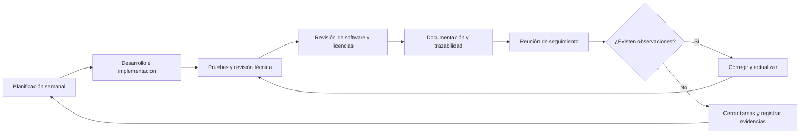

# Plan de Dedicación Semanal

- **Proyecto Universitario:** 15-20 horas/semana por estudiante
```diff
- COMENTARIO – CARI QUISPE JUAN MANUEL:
- La cantidad de horas semanales propuesta permite estimar la dedicación
- general de los estudiantes; sin embargo, no se especifica cómo se
- distribuirá ese tiempo entre las diferentes actividades del proyecto.
- Se recomienda definir horas para desarrollo, documentación, pruebas,
- revisión de software y licencias, registro de versiones y actualización
- de la trazabilidad. Esta distribución permitiría comprobar que las
- actividades de gobernanza no sean postergadas frente al desarrollo técnico.
```
- **Proyecto Empresa:** 20-25 horas/semana por estudiante
- Reuniones de Squad: 2 por semana
- Revisión con Chapter (Profesor): 1 por semana
```diff
- COMENTARIO – CARI QUISPE JUAN MANUEL:
- Las reuniones semanales son adecuadas para coordinar y revisar avances;
- sin embargo, el documento no indica qué evidencias deberán presentarse
- en cada reunión. Se propone que cada revisión incluya productos
- verificables, como registros de versiones, licencias revisadas, cambios
- documentados, incidencias atendidas y tareas pendientes.
- También debería asignarse un responsable de registrar los acuerdos y
- realizar el seguimiento de su cumplimiento.
-
- Como propuesta complementaria, se plantea una distribución referencial
- de las horas semanales. Su finalidad es evitar que el equipo dedique todo
- el tiempo únicamente al desarrollo técnico y deje de lado actividades
- importantes como documentación, pruebas, revisión de licencias y
- mantenimiento de la trazabilidad.
```

### Distribución de la dedicación semanal

| Actividad | Proyecto universitario | Proyecto empresarial |
|---|---:|---:|
| Desarrollo e implementación | 6–8 horas | 8–10 horas |
| Documentación y trazabilidad | 3–4 horas | 4–5 horas |
| Pruebas y revisión de seguridad | 3–4 horas | 4–5 horas |
| Revisión de software y licencias | 1–2 horas | 2–3 horas |
| Reuniones y coordinación | 2 horas | 2 horas |
| **Total semanal** | **15–20 horas** | **20–25 horas** |

> **Nota:** Esta distribución es referencial y deberá ajustarse según la
> fase del proyecto, las tareas asignadas y las necesidades reales del equipo.

### Ciclo semanal de trabajo propuesto


